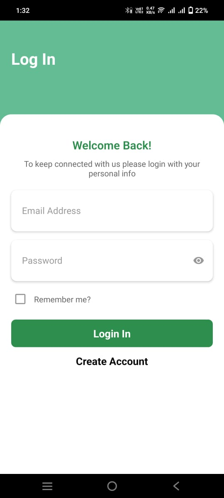
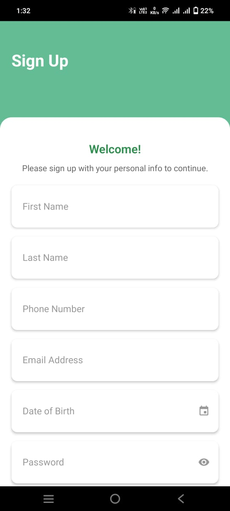
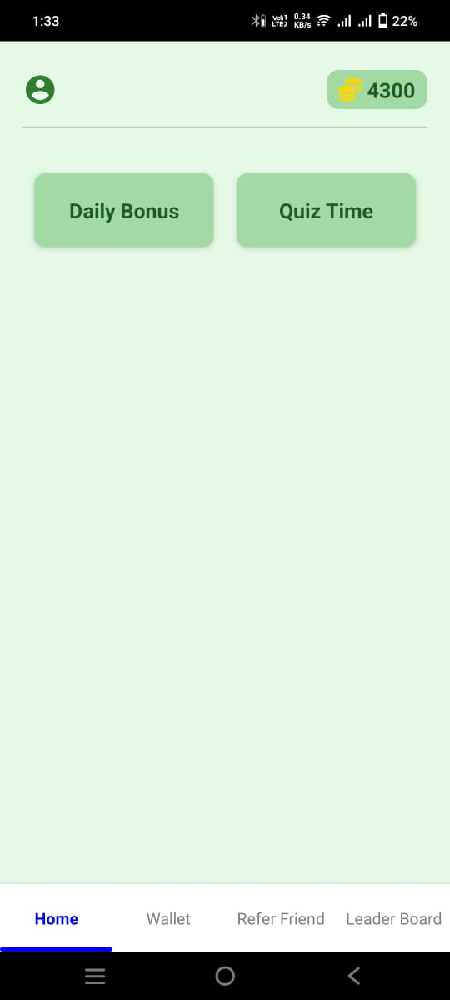
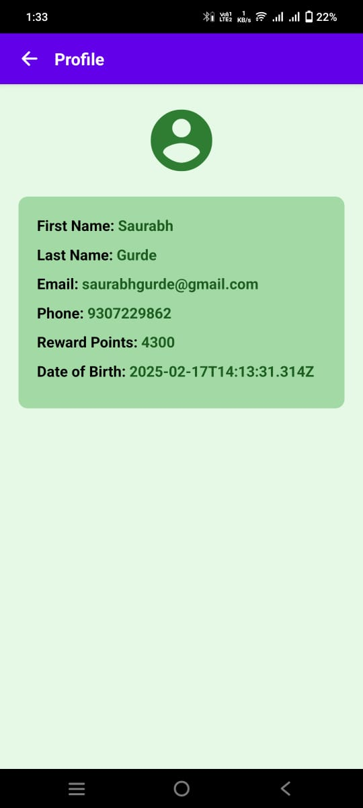
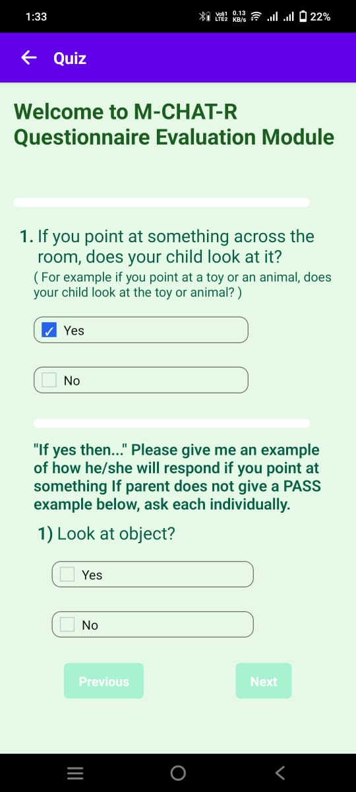
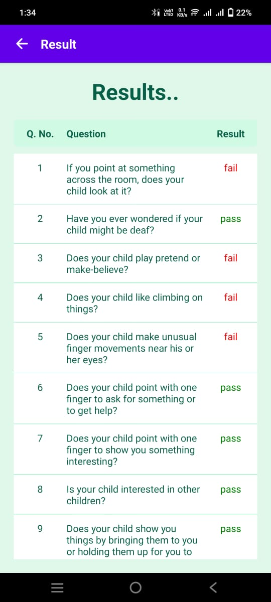
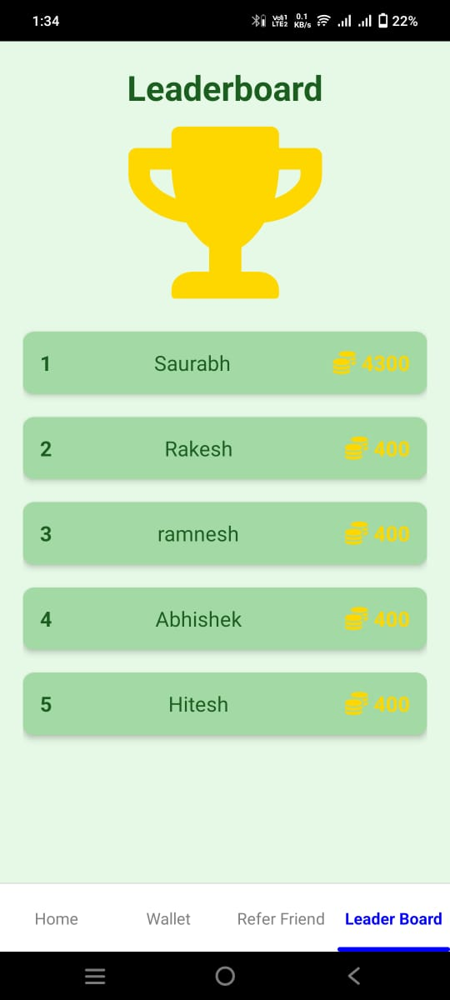
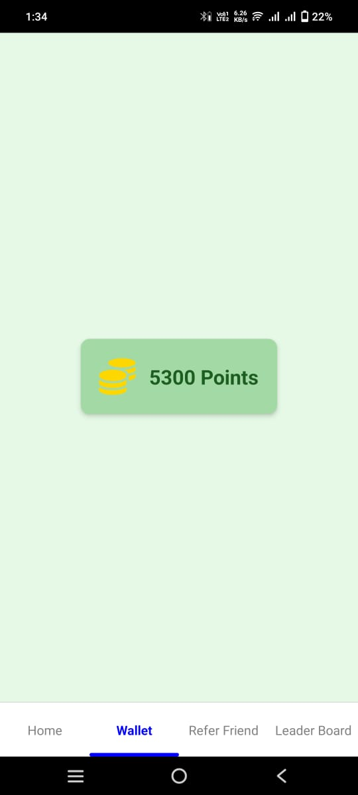

Quiz Reward app

Check for App link
https://drive.google.com/file/d/1kgKs0vXgq-ZXtSkgaoumn94fsP2pRmP1/view?usp=drive_link

https://dailytodo.saurabhgurde.life/

### Screenshots  

<table>
  <tr>
    <td></td>
    <td></td>
    <td></td>
  </tr>
  <tr>
    <td></td>
    <td></td>
    <td></td>
  </tr>
  <tr>
    <td></td>
    <td></td>
    <td></td>
  </tr>
</table>


### Installing

Make sure that you have proper react native setup

```bash
cd app
```
```bash
npm i
```
```bash
cd server
```
```bash
npm i
```

### Run project

## For front end
```bash
cd client
```
```bash
npm start
```

## For server

Open new terminal
```bash
cd server && cp .env.example .env
```

```bash
npm i
```


